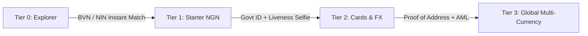

Searched for "bvn"
Listed directory app
Viewed add-money.tsx:1-60

For a professional-grade, multi-currency fintech app like **Chipa** (handling NGN, USD, GBP, EUR), the industry gold standard is **Progressive Tiered KYC with Just-in-Time Interceptors** (as implemented by Revolut, Chipper Cash, Kuda, and Wise).

Here is the recommended architecture covering UX, Compliance, Database, and Security:

---

### 1. The 3-Tier Compliance & Capability Model

Instead of presenting an intimidating verification wall on day one, give users immediate access to explore the app at **Tier 0**, and progressively unlock capabilities as they verify identity.



| Tier                 | Requirements                                                                                   | Verification Provider        | Capabilities Unlocked                                                                                       | Limits                                             |
| :------------------- | :--------------------------------------------------------------------------------------------- | :--------------------------- | :---------------------------------------------------------------------------------------------------------- | :------------------------------------------------- |
| **Tier 0: Explorer** | Email, Phone, Basic Profile, PIN                                                               | Internal (Auth)              | Explore app, view live FX rates, browse virtual cards, explore bills                                        | **No financial inflows/outflows**                  |
| **Tier 1: Starter**  | **BVN or NIN** (11 digits) + Date of Birth matching                                            | Monnify / QoreID / Dojah     | Instant **NGN virtual account** (Wema/Sterling via Monnify), domestic bank transfers, bill payments         | Daily limit: ₦50,000<br/>Balance cap: ₦300,000     |
| **Tier 2: Standard** | **Government Photo ID** (Passport, Driver's License, National ID) + **Facial Liveness Selfie** | Smile ID / QoreID / Sumsub   | **Virtual & Physical Cards** (Visa/Mastercard), **FX Currency Swaps** (e.g. NGN ↔ USD)                      | Daily limit: ₦5,000,000<br/>Card spending unlocked |
| **Tier 3: Global**   | **Proof of Address** (Utility bill / bank statement < 3 months) + PEP/Sanctions screening      | Smile ID / Manual Compliance | **Global Multi-Currency Accounts**:<br/>• ClearJunction EUR & GBP IBANs<br/>• LeadBank US Routing / Account | Unlimited / High tier limits                       |

---

### 2. In-App User Experience (UX)

#### A. "Just-In-Time" Action Interceptors

Do not force the user through full KYC immediately after onboarding unless they attempt an action requiring it:

- If a Tier 0 user taps **"Add Money"** or **"Transfer"** on the Home screen:
  - Present a sleek bottom sheet:
    > _"Verify your BVN or NIN in 30 seconds to receive your dedicated account number."_
  - User types their 11-digit BVN/NIN -> verified in 2–3 seconds via API -> Monnify generates their dedicated account number immediately.
- If a Tier 1 user taps **"Create Card"** or **"Open USD Account"**:
  - Present a prompt:
    > _"Central Bank regulations require a quick identity check and selfie before issuing payment cards."_
  - Launches camera for Document capture + 3D facial liveness.

#### B. Dedicated Verification Hub (`/settings/kyc`)

- Shows their current tier badge (`Tier 1 Verified`, `Tier 2 Pending`).
- Shows transparent progress bars for daily/monthly limits.
- Clear breakdown of what each tier unlocks.

---

### 3. Database Architecture

Do not clutter the main `users` table with dozens of KYC documents and verification artifacts. Use a dedicated `kyc_verifications` table with a clean summary column on `users`:

```sql
-- 1. On users table: high-level tier tracking
ALTER TABLE users ADD COLUMN kyc_tier SMALLINT DEFAULT 0;
ALTER TABLE users ADD COLUMN kyc_status VARCHAR(30) DEFAULT 'unverified'
  CHECK (kyc_status IN ('unverified', 'pending', 'verified', 'rejected'));
ALTER TABLE users ADD COLUMN bvn VARCHAR(11);
ALTER TABLE users ADD COLUMN nin VARCHAR(11);

-- 2. Dedicated audit & verification tracking table
CREATE TABLE kyc_verifications (
  id                  BIGINT GENERATED ALWAYS AS IDENTITY PRIMARY KEY,
  user_id             BIGINT NOT NULL REFERENCES users(id) ON DELETE CASCADE,
  tier                SMALLINT NOT NULL,              -- 1, 2, 3
  verification_type   VARCHAR(50) NOT NULL,          -- 'bvn', 'nin', 'id_document', 'liveness_selfie', 'proof_of_address'
  provider            VARCHAR(50) NOT NULL,          -- 'monnify', 'qoreid', 'smile_id'
  provider_reference  VARCHAR(255),                  -- Third-party verification ID
  status              VARCHAR(30) NOT NULL           -- 'pending', 'verified', 'rejected'
    CHECK (status IN ('pending', 'verified', 'rejected')),
  document_file_id    BIGINT REFERENCES files(id),   -- Stored encrypted in Cloudflare R2
  rejection_reason    TEXT,
  metadata            JSONB,                         -- Provider payload (name matching score, etc.)
  verified_at         TIMESTAMPTZ,
  created_at          TIMESTAMPTZ DEFAULT NOW(),
  updated_at          TIMESTAMPTZ DEFAULT NOW()
);

CREATE INDEX idx_kyc_verifications_user_id ON kyc_verifications(user_id);
CREATE INDEX idx_kyc_verifications_status ON kyc_verifications(status);
```

---

### 4. Security & Compliance Essentials

1. **Strict Name & DOB Matching**:
   - When the user submits a BVN or NIN, the verification provider returns the registered legal first name, last name, and DOB from NIBSS/NIMC.
   - The backend must perform fuzzy or exact matching against the user's signup profile to prevent identity theft (using another person's BVN).
2. **PII Storage & Data Privacy (NDPR / GDPR)**:
   - ID documents and selfies must be stored in Cloudflare R2 with **private buckets** (using your existing [r2_service.go](file:///c:/Users/danie/Desktop/Repos/Chipa/apps/api/internal/service/r2/r2_service.go)), never publicly accessible URLs.
   - Serve documents only through short-lived (15-minute) pre-signed URLs for internal compliance review.
   - Mask BVN/NIN in API responses (`222*****123`).
3. **Real-time Webhooks & Notifications**:
   - For Tier 2 & 3 (Smile ID / QoreID), verifications often complete asynchronously via webhook:
     - Backend receives `POST /api/v1/webhooks/kyc`.
     - Updates `kyc_verifications` and upgrades `users.kyc_tier`.
     - Automatically broadcasts a Pusher/realtime event to the mobile app so the user's screen instantly updates without them needing to pull to refresh.

---

### Summary Recommendation for Chipa

- **At Onboarding**: Keep onboarding lightweight (Email OTP -> Password -> User created -> Phone OTP -> Address & Names -> PIN -> Active).
- **Immediately upon Landing in the App**: Greet them with Tier 0 access. Prompt for **BVN / NIN** to generate their Monnify virtual account and unlock Tier 1 domestic transactions.
- **For FX & Cards**: Prompt for **Photo ID + Liveness Selfie** (Tier 2) when they navigate to create a Visa/Mastercard or swap to USD/EUR.
