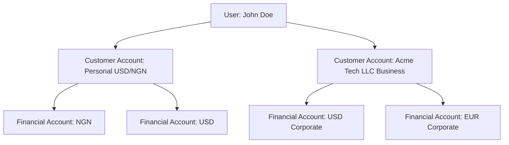

No, **[20260606105900_users.sql](file:///c:/Users/danie/Desktop/Repos/Chipa/apps/api/db/migrations/20260606105900_users.sql) in its current form is not the best.**

While our changes removed the obvious electoral remnants (`voters_card_verified`, candidate screening fields, religion) and added initial fintech flags (`user_type`, `country_code`, `nationality`), it is still structured as a **monolithic, legacy table** rather than a **decoupled, bank-grade identity system**.

When we compare our schema against **Cleva (`getcleva.com`)**, **Stripe**, **Raenest**, and **Grey**, there are major architectural, compliance, and security paradigms they implement that we should adopt.

---

## The Architectural Comparison

| Dimension                     | Our Current `users.sql`                                                                           | Cleva / Stripe / Raenest / Grey                                                                                                                                            | Impact & Risk in Our Current Model                                                                              |
| :---------------------------- | :------------------------------------------------------------------------------------------------ | :------------------------------------------------------------------------------------------------------------------------------------------------------------------------- | :-------------------------------------------------------------------------------------------------------------- |
| **Identity Architecture**     | **Monolithic God Table**: Auth, profile, address, KYC numbers, and status packed into one table.  | **Decoupled Identity**: <br>• `users` (Auth & Security)<br>• `user_profiles` (Legal PII)<br>• `addresses` (Normalized Addresses)<br>• `identity_documents` (Encrypted IDs) | Every query for a user loads high-risk PII into memory; violates SOC 2 & GDPR data minimization.                |
| **Primary Key & Public ID**   | `id BIGINT` + ad-hoc `fake_id BIGINT` hack.                                                       | **UUIDv7 + Prefixed Public IDs** (`usr_01H...`, `acct_01H...`).                                                                                                            | `fake_id` is an awkward workaround that clutters queries and handlers instead of standard typed public IDs.     |
| **Sensitive PII (BVN/NIN)**   | **Plaintext**: Stored directly in `users.bvn` and `users.nin`.                                    | **Encrypted at Rest + Blind Index**: `bvn_encrypted BYTEA` + `bvn_hash CHAR(64)` for deterministic lookup.                                                                 | Immediate audit failure (NDPR, SOC 2, PCI-DSS); a read replica or SQL injection exposes all customer BVNs/NINs. |
| **Multi-Tenancy**             | Single-user tied directly to accounts. No support for corporate entities without separate logins. | **User vs. Customer Account vs. Organization**: A human user can own a personal account and switch into business entities.                                                 | Cannot support remote businesses, startups, or freelancers opening corporate USD accounts.                      |
| **Session & Device Security** | Stateless JWT + basic Redis key. No device tracking.                                              | **`devices` & `sessions` Tables**: Fingerprinting, trust scores, IP tracking, and instant remote revocation.                                                               | Vulnerable to session hijacking; cannot alert user of logins from new devices.                                  |
| **Lifecycle & Deletion**      | Hard deletes possible; no soft deletion timestamp.                                                | **Strict Soft Deletion**: `status`, `closed_at`, `deleted_at`, and append-only audit trail.                                                                                | Violates financial regulatory record retention rules (CBN/FinCEN require 5–7 years auditability).               |

---

## The 6 Critical Patterns Cleva & Stripe Do Better

### 1. PII Isolation & Data Minimization (SOC 2 & GDPR Compliance)

In modern banking architectures, **authentication credentials** must be separated from **Personally Identifiable Information (PII)**:

- **`users` table** should ONLY store credentials and account lifecycle: `id`, `public_id`, `email`, `phone`, `password_hash`, `pin_hash`, `status`, `country_code`, `created_at`, `updated_at`.
- **`user_profiles` table** holds legal identity: `legal_first_name`, `legal_middle_name`, `legal_last_name`, `date_of_birth`, `gender`, `nationality`.
- **Why?** When our JWT authentication middleware validates a token on 50 requests/second, it only queries the lightweight `users` table. Sensitive PII is never loaded into application memory or API caches unless explicitly needed for a compliance or KYC review.

### 2. Bank-Grade PII Encryption (Blind Indexing)

In Cleva and Stripe, raw national identity numbers are **never stored in plaintext**:

```sql
-- How Cleva & Stripe store BVN, SSN, or NIN:
bvn_encrypted BYTEA NOT NULL,       -- Encrypted with AES-256-GCM using application KMS key
bvn_hash      CHAR(64) UNIQUE,      -- HMAC-SHA256(bvn, secret_pepper) for fast exact matches
```

- **Lookup**: When a user inputs their BVN, the API computes `HMAC-SHA256(input, pepper)` and searches `WHERE bvn_hash = $1`.
- **Display**: The application decrypts `bvn_encrypted` only when rendering the masked `•••••••1234` in compliance admin panels.
- If an attacker dumps the database, **zero BVNs or NINs are compromised**.

### 3. Decoupling the "Human" from the "Account" (Multi-Currency & Business Support)

Notice how Cleva separates **Users** from **Customer Accounts**:



- **Today in Chipa**: `financial_accounts.user_id` points directly to `users.id`.
- **In Cleva & Stripe**: `customer_accounts` connects the human (or organization) to their currencies. This enables:
  1. A Nigerian freelancer receiving client funds personally.
  2. The same freelancer managing a registered US/UK LLC entity without having to register a second email and switch accounts.
  3. Co-founders/teams having granular roles (Viewer, Finance, Admin) on the same company wallet.

### 4. Ditching `fake_id` for Prefixed Public IDs

Our current schema has:

```sql
id BIGINT GENERATED ALWAYS AS IDENTITY PRIMARY KEY,
fake_id BIGINT UNIQUE
```

This was a common legacy trick in older monoliths to prevent users from guessing sequential IDs (`/users/1`, `/users/2`). However:

- It creates massive developer confusion (e.g. `GetUserByID` vs `GetUserByFakeID`).
- Cleva and Stripe standardize on:
  - Internal PK: `UUID` (specifically **UUIDv7**, which is timestamp-ordered and fast for B-Tree indexing).
  - External Public ID: `public_id VARCHAR(32)` formatted like Stripe (`usr_01H...`, `txn_01H...`, `crd_01H...`).

### 5. Device Fingerprinting & Session Hardening

Cleva and Grey prevent account takeovers using a dedicated `devices` and `sessions` model:

- `devices`: `device_id UUID`, `fingerprint_hash`, `platform (iOS/Android)`, `trusted BOOLEAN`.
- If a withdrawal or card creation is attempted from an **unrecognized device**, the transaction is placed on hold or challenges the user with a secondary 2FA / push prompt before funds can leave.

### 6. Address Normalization for Global Mobility

Our current schema hardcodes:

```sql
current_country, current_state, current_city, street_address, postal_code
```

In modern cross-border platforms (Grey, Cleva, Raenest):

- African remote workers frequently relocate (e.g., Nigeria → UK on Global Talent, or UAE nomad visa).
- An `addresses` table allows users to maintain:
  - `residential` address (determines tax/KYC jurisdiction).
  - `mailing` address (for physical debit card delivery).
  - An audit trail of past addresses to satisfy compliance audits.

---

## Recommended Target Architecture for Chipa

To reach the tier of **Cleva, Stripe, and Raenest**, here is the enterprise schema blueprint:

```sql
-- ============================================================================
-- 1. AUTHENTICATION & CREDENTIALS (Strictly Minimal, High Security)
-- ============================================================================
CREATE TABLE users (
  id UUID PRIMARY KEY DEFAULT gen_random_uuid(),
  public_id VARCHAR(32) UNIQUE NOT NULL, -- e.g. "usr_01h8..."
  email VARCHAR(255) UNIQUE NOT NULL,
  phone VARCHAR(25) UNIQUE,
  password_hash TEXT NOT NULL,
  pin_hash VARCHAR(100),
  user_type VARCHAR(20) NOT NULL DEFAULT 'individual' CHECK (user_type IN ('individual', 'business')),
  status VARCHAR(20) NOT NULL DEFAULT 'pending' CHECK (status IN ('pending', 'active', 'suspended', 'closed')),
  country_code CHAR(2) NOT NULL DEFAULT 'NG',
  timezone VARCHAR(50) DEFAULT 'Africa/Lagos',
  last_login_at TIMESTAMPTZ,
  created_at TIMESTAMPTZ NOT NULL DEFAULT NOW(),
  updated_at TIMESTAMPTZ NOT NULL DEFAULT NOW(),
  deleted_at TIMESTAMPTZ NULL
);

-- ============================================================================
-- 2. LEGAL PROFILES (Isolated PII with Restrictive Access Controls)
-- ============================================================================
CREATE TABLE user_profiles (
  user_id UUID PRIMARY KEY REFERENCES users(id) ON DELETE CASCADE,
  first_name VARCHAR(50) NOT NULL,
  last_name VARCHAR(50) NOT NULL,
  middle_name VARCHAR(50),
  date_of_birth DATE,
  gender VARCHAR(10) CHECK (gender IN ('male', 'female')),
  nationality CHAR(2) NOT NULL DEFAULT 'NG',
  profile_photo_url TEXT,
  employment_status VARCHAR(30),
  occupation VARCHAR(100),
  created_at TIMESTAMPTZ NOT NULL DEFAULT NOW(),
  updated_at TIMESTAMPTZ NOT NULL DEFAULT NOW()
);

-- ============================================================================
-- 3. NORMALIZED ADDRESSES (Residential, Mailing & Delivery)
-- ============================================================================
CREATE TABLE addresses (
  id UUID PRIMARY KEY DEFAULT gen_random_uuid(),
  user_id UUID NOT NULL REFERENCES users(id) ON DELETE CASCADE,
  address_type VARCHAR(20) NOT NULL DEFAULT 'residential' CHECK (address_type IN ('residential', 'business', 'mailing')),
  line_1 VARCHAR(255) NOT NULL,
  line_2 VARCHAR(255),
  city VARCHAR(100) NOT NULL,
  state VARCHAR(100),
  postal_code VARCHAR(20),
  country_code CHAR(2) NOT NULL DEFAULT 'NG',
  is_current BOOLEAN NOT NULL DEFAULT true,
  created_at TIMESTAMPTZ NOT NULL DEFAULT NOW(),
  updated_at TIMESTAMPTZ NOT NULL DEFAULT NOW()
);

-- ============================================================================
-- 4. IDENTITY DOCUMENTS & ENCRYPTED VAULT (Bank-Grade Security)
-- ============================================================================
CREATE TABLE identity_documents (
  id UUID PRIMARY KEY DEFAULT gen_random_uuid(),
  user_id UUID NOT NULL REFERENCES users(id) ON DELETE CASCADE,
  document_type VARCHAR(30) NOT NULL CHECK (document_type IN ('bvn', 'nin', 'passport', 'drivers_license', 'national_id')),
  document_number_encrypted BYTEA NOT NULL, -- Encrypted at rest
  document_number_hash CHAR(64) NOT NULL,    -- Blind index for lookups
  document_file_id UUID,
  selfie_file_id UUID,
  issuing_country CHAR(2) NOT NULL DEFAULT 'NG',
  status VARCHAR(20) NOT NULL DEFAULT 'pending' CHECK (status IN ('pending', 'verified', 'rejected')),
  verified_at TIMESTAMPTZ,
  created_at TIMESTAMPTZ NOT NULL DEFAULT NOW(),
  UNIQUE(user_id, document_type)
);

CREATE INDEX idx_id_docs_hash ON identity_documents(document_type, document_number_hash);

-- ============================================================================
-- 5. DEVICE SECURITY & SESSIONS (Prevent Account Takeover)
-- ============================================================================
CREATE TABLE devices (
  id UUID PRIMARY KEY DEFAULT gen_random_uuid(),
  user_id UUID NOT NULL REFERENCES users(id) ON DELETE CASCADE,
  device_fingerprint_hash CHAR(64) NOT NULL,
  platform VARCHAR(20) NOT NULL, -- 'ios', 'android', 'web'
  device_name VARCHAR(100),
  is_trusted BOOLEAN NOT NULL DEFAULT false,
  last_seen_at TIMESTAMPTZ NOT NULL DEFAULT NOW(),
  created_at TIMESTAMPTZ NOT NULL DEFAULT NOW(),
  UNIQUE(user_id, device_fingerprint_hash)
);
```

---

## Suggested Plan of Action

If you want our platform to genuinely rival Cleva, Stripe, and Raenest in terms of security and architecture, we can evolve the schema in two smooth phases:

1. **Phase 1 (Immediate Cleanups in current schema)**:
   - Eliminate `fake_id` in favor of standard UUIDs / typed public IDs (`usr_...`).
   - Add `identity_documents` with encrypted vaulting for BVN/NIN.
   - Separate address fields into structured address representation.
2. **Phase 2 (Enterprise Multi-Tenancy & Device Security)**:
   - Add `devices` table for push notification tokens, device fingerprinting, and new-device login challenges.
   - Add `organizations` table when ready to open corporate/freelancer registered business accounts.

Would you like to proceed with refactoring the identity layer to this decoupled, encrypted standard?
